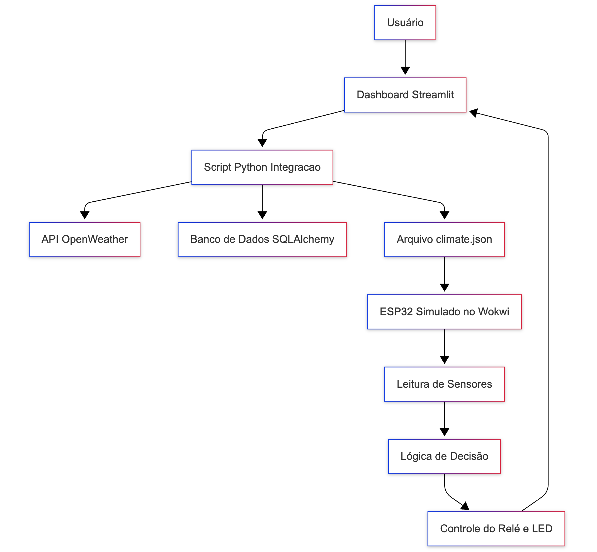

# FIAP - Faculdade de Informática e Administração Paulista

<p align="center">
<a href= "https://www.fiap.com.br/"></a>
</p>

<br>

# Nome do projeto

CAP 1 - Um mapa do tesouro
Sistema de irrigação inteligente com ESP32 e Python

## Nome do grupo

Grupo 73

## 👨‍🎓 Integrantes:

- <a href="https://www.linkedin.com/in/anacornachi/">Ana Cornachi</a>
- <a href="https://www.linkedin.com/in/carlamaximo/">Carla Máximo</a>
- <a href="https://www.linkedin.com/in/lucas-lins-lima/">Lucas Lins</a>

## 👩‍🏫 Professores:

### Tutor(a)

- <a href="https://www.linkedin.com/in/lucas-gomes-moreira-15a8452a/">Lucas Gomes Moreira</a>

### Coordenador(a)

- <a href="https://www.linkedin.com/in/andregodoichiovato/">André Godoi Chiovato</a>

## 📜 Descrição

O presente projeto propõe uma **solução de irrigação inteligente** desenvolvida em duas camadas: uma camada física embarcada com **ESP32** simulada no Wokwi e uma camada lógica em **Python**, responsável por decisões com base em dados meteorológicos e armazenamentos em banco de dados SQL.

A iniciativa parte de uma problemática real: o desperdício de água e a ineficiência na irrigação agrícola, especialmente em pequenas propriedades. Como solução, construímos um sistema que **lê variáveis ambientais** (umidade do solo, pH, nutrientes) e as combina com **dados climáticos reais** (via OpenWeather API), para decidir **automaticamente** se a bomba de irrigação deve ser ativada ou não.

No ambiente simulado, a parte física foi modelada com o simulador Wokwi, utilizando sensores como:

- Botões para simular presença de Fósforo (P) e Potássio (K)
- Sensor LDR simulando pH do solo
- Sensor DHT22 para umidade
- Relé e LED controlando a bomba de irrigação

Já o código Python consome uma API pública de clima, grava os dados em banco de dados relacional, permite análises via dashboard Streamlit, e simula o envio de comandos ao ESP32 via serial (ou via JSON em contexto de simulação).

Além disso, exploramos os conceitos de **IoT, automação agrícola, integração com APIs REST, banco de dados, POO, testes e dashboards interativos**, reforçando a aplicação prática de conteúdos aprendidos.

Diagrama DAP - Funcionamento da Solução


## 📁 Estrutura de pastas

Dentre os arquivos e pastas presentes na raiz do projeto, definem-se:

```
src/
├── esp32/ # Projeto do microcontrolador ESP32 (PlatformIO + C++)
├── python/ # Scripts Python (API, banco, dashboard, integração)
├── assets/ # Imagens, gráficos e materiais estáticos
├── document/ # Documentos acadêmicos e relatórios
```

Para mais detalhes sobre cada parte, consulte os READMEs específicos:

[📘 README do projeto ESP32](src/esp32/README.md)

[🐍 README do projeto Python + Dashboard](src/python/README.md)

## 🔧 Como executar o código

### Pré-requisitos:

- Python 3.10+
- PlatformIO e Wokwi instalados no VSCode
- Variáveis definidas em .env com:

```bash
OPEN_WEATHER_API_KEY=
OPEN_WEATHER_CITY=São Paulo
```

### Etapas gerais

1. Clone o repositório:

```bash
git clone https://github.com/anacornachi/FIAP-F3-C1.git
```

2. Execute o projeto ESP32 (via Wokwi):
   Abra a pasta src/esp32 no VSCode e compile com

```bash
  cd src/esp32
  pio run
```

3. Inicie a simulação com Wokwi: Start Simulator

4. Execute o projeto Python:

```bash
cd src/python
pip install -r requirements.txt
python main.py
```

5. Abra o dashboard de visualização:

```bash
streamlit run app_dashboard.py
```

### 📌 Observações Finais

Como este projeto foi desenvolvido em um ambiente 100% simulado, não é possível estabelecer comunicação direta entre ESP32 e Python por porta serial. Para isso, utilizamos um arquivo climate.json como ponte de simulação dos dados meteorológicos.

Em um cenário real, essa comunicação seria feita com um ESP32 físico e uma conexão serial real utilizando pyserial.

## 🗃 Histórico de lançamentos

- 0.3.0 - 04/05/2025
  - ESP32 (src/esp32)
    - Suporte à integração com climate.json (simulação da API OpenWeather).
    - Delay ajustado para 10 minutos por ciclo.
    - Código C++ comentado e otimizado.
    - README atualizado com lógica, simulações sugeridas e limitações do Wokwi.
  - Python (src/python)
    - Integração com API OpenWeather para coleta e envio de dados climáticos simulados.
    - CRUD completo com SQLAlchemy para climate_data, sensor_records e components.
  - Dashboard interativo com Streamlit:
    - Gráficos (linha, dispersão, histograma)
    - Exportação para CSV/PDF
    - Edição e exclusão de registros
    - Logger colorido e estruturado por arquivo.
  - Geral:
    - README principal reestruturado com base em PBL.
    - Inclusão de imagem DAP explicando o fluxo da aplicação local.
    - Links diretos para os projetos específicos (/src/esp32 e /src/python).
- 0.2.0 - 02/05/2025
  - Python (src/python)
    - Implementação da dashboard interativa com Streamlit.
    - Visualização completa dos dados climáticos, sensores e componentes.
    - Funcionalidades:
      - Cadastro, edição e exclusão de registros (CRUD)
      - Gráficos dinâmicos (temperatura, umidade, correlação)
      - Exportação de dados para CSV e PDF
      - Integração com serviços existentes do projeto python (sem necessidade de duplicação de lógica).
- 0.1.0 - 30/04/2025
  - Implementação inicial do sistema de irrigação inteligente utilizando ESP32
  - Adicionada leitura de sensores: umidade do solo (DHT22), presença de fósforo e potássio (botões físicos) e simulação de pH (sensor LDR)
  - Desenvolvimento da lógica de ativação e desativação da bomba de irrigação com base nas condições do solo
  - Integração do controle do relé e indicador LED
  - Construção do circuito completo no Wokwi para simulação do hardware
  - Criação de documentação detalhada no README, incluindo descrição do projeto, lógica de decisão baseada em fontes acadêmicas e imagem do circuito

## 📋 Licença

<p xmlns:cc="http://creativecommons.org/ns#" xmlns:dct="http://purl.org/dc/terms/"><a property="dct:title" rel="cc:attributionURL" href="https://github.com/agodoi/template">MODELO GIT FIAP</a> por <a rel="cc:attributionURL dct:creator" property="cc:attributionName" href="https://fiap.com.br">Fiap</a> está licenciado sobre <a href="http://creativecommons.org/licenses/by/4.0/?ref=chooser-v1" target="_blank" rel="license noopener noreferrer" style="display:inline-block;">Attribution 4.0 International</a>.</p>

```

```
