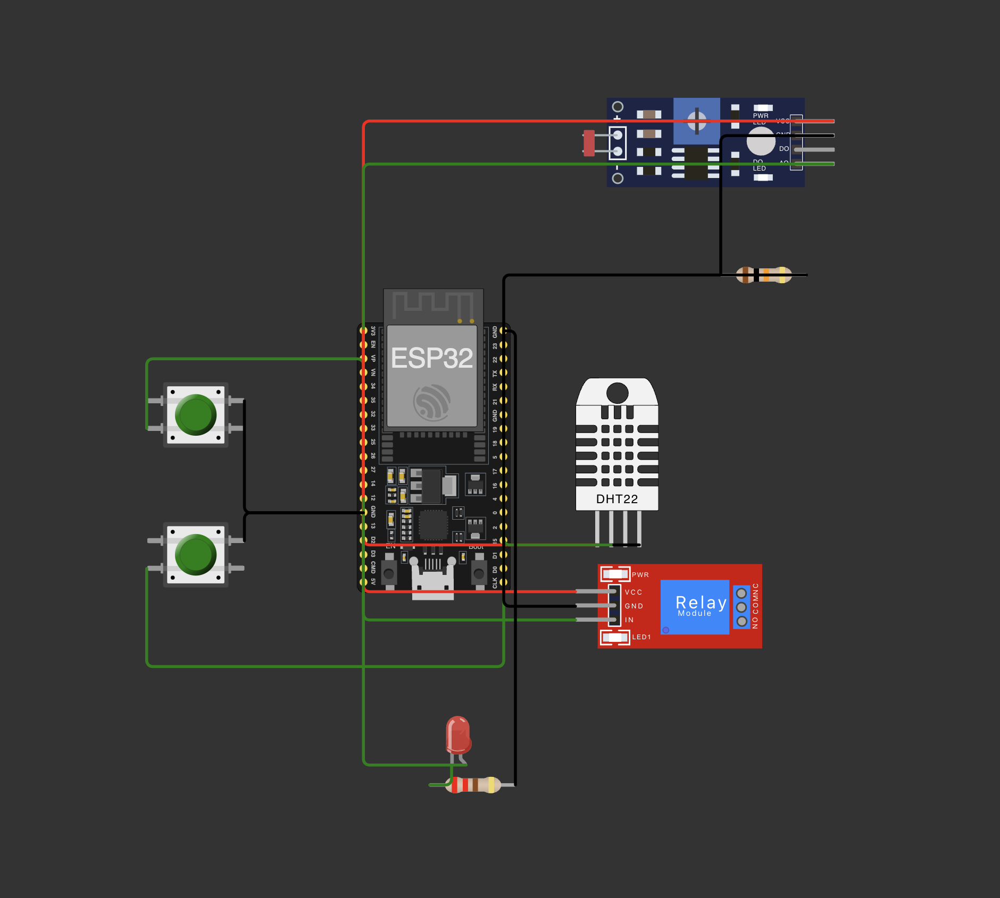

# Sistema de sensores e controle com ESP32

Este projeto implementa um sistema de irrigação inteligente utilizando a plataforma ESP32, sensores simulados no ambiente Wokwi e integração com o PlatformIO no VSCode.

O objetivo é criar um protótipo funcional capaz de **monitorar variáveis do solo** (umidade, nutrientes e pH) e **acionar a bomba de irrigação** conforme condições previamente estabelecidas.

## Objetivos da entrega 1

- Construir o circuito de sensores usando as extensões Wokwi e PlatformIO.
- Criar código em C/C++ para ler os sensores e acionar o relé conforme a lógica definida.
- Comentar o código explicando a lógica utilizada.
- Documentar o circuito com imagem no README.

## Circuito desenvolvido

O circuito foi construído simulando:

| Componente           | Função                                                  |
| :------------------- | :------------------------------------------------------ |
| Botão 1 (GPIO14)     | Simula presença de Fósforo no solo                      |
| Botão 2 (GPIO4)      | Simula presença de Potássio no solo                     |
| Sensor LDR (GPIO34)  | Simula sensor de pH (luz → analogia pH)                 |
| Sensor DHT22 (GPIO5) | Mede umidade do solo                                    |
| Relé (GPIO12)        | Controla acionamento da bomba de irrigação              |
| LED (GPIO13)         | Indica status da bomba: ligado (irrigando) ou desligado |

## Lógica de controle da irrigação

A decisão de irrigar ou não foi baseada em materiais técnicos reais:

- [Fonte 1 - Efeito do pH na disponibilidade de nutrientes](https://www.scielo.br/j/eagri/a/339msPdHQFSWwbrsNsPn7QM/)
- [Fonte 2 - Relação entre pH e Fósforo no solo](https://www.scielo.br/j/rbeaa/a/sPdhtHwBDqMWxn5p53hV46s)
- [Fonte 3 - Manual de Irrigação por Tangerino](https://www2.feis.unesp.br/irrigacao/pdf/conird2005_tangerino.pdf)

Com base nas leituras, define-se:

## **Cenários para ativação da irrigação**

- **Umidade do solo abaixo de 40%** e **presença de fósforo** ➔ Necessidade de água para absorção eficiente de nutrientes.
- **pH do solo entre 6,2 e 6,8** ➔ Faixa ideal para disponibilidade de fósforo, combinada com baixa umidade.

## **Cenários para desligamento da irrigação**

- **Umidade do solo acima de 70%** ➔ Evitar saturação do solo e lixiviação de nutrientes.
- **pH fora da faixa ideal** (abaixo de 5,5 ou acima de 7,0) ➔ Disponibilidade de nutrientes é reduzida.

## Funcionamento geral

- A cada ciclo (2 segundos), o sistema:
  - Lê a umidade via DHT22.
  - Lê a presença de fósforo e potássio via botões.
  - Lê o pH do solo via sensor LDR (lux convertido para escala de pH).
  - Decide acionar ou desligar a bomba de irrigação conforme a lógica implementada.
  - Atualiza o status do LED vermelho conforme a irrigação ativa ou inativa.

## Circuito no Wokwi

## Observações

- A conversão de lux para pH foi feita de forma simulada usando interpolação proporcional (`analogRead` mapeado para escala de pH 0–14).
- O sistema foi programado para ser robusto mesmo em variações abruptas de leitura simulada.
- As decisões foram embasadas em artigos técnicos agrícolas e guias acadêmicos para reforçar a lógica implementada.

## Estrutura de entrega

Toda a lógica relacionada ao sistema do ESP32 (código-fonte, circuito, testes e documentação) está localizada dentro da pasta src/esp32/.

Portanto, todos os caminhos abaixo consideram como raiz o diretório src/esp32/.

| Arquivo                | Descrição                                            |
| :--------------------- | :--------------------------------------------------- |
| `src/main.cpp`         | Código fonte em C++ para controle de sensores e relé |
| `diagram.json`         | Definição do circuito no Wokwi                       |
| `circuito-esp32-wokwi` | Imagem exportada do circuito                         |
| `README.md`            | Documentação do projeto                              |

## Como rodar o projeto

1. Clone o repositório.
2. Abra o projeto no VSCode com PlatformIO instalado.
3. Certifique-se de estar com a extensão Wokwi instalada.
4. Compile (`pio run`) e execute (`Wokwi: Start Simulator`).
5. Acompanhe o comportamento dos sensores e a ativação da bomba de irrigação no monitor serial.

## Status da Entrega

- [x] Circuito construído no Wokwi
- [x] Código funcional em C++ no GitHub
- [x] Imagem do circuito exportada
- [x] README.md completo e documentado
