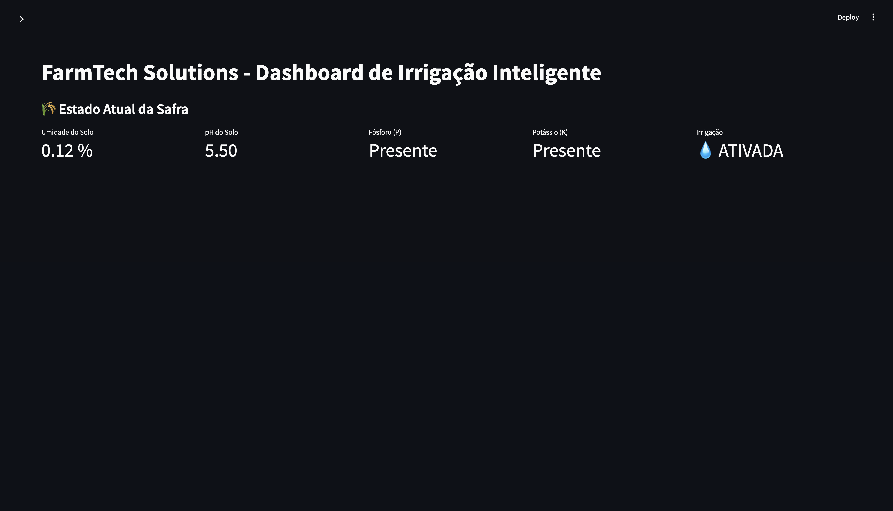
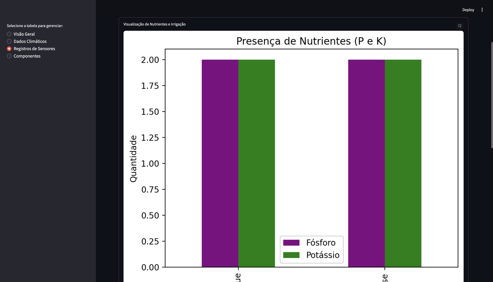
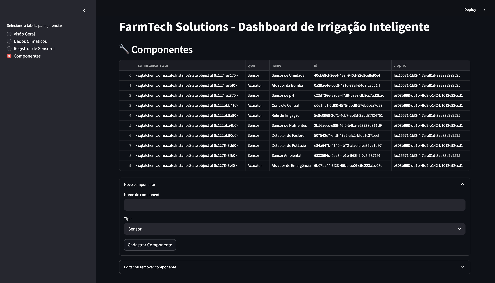
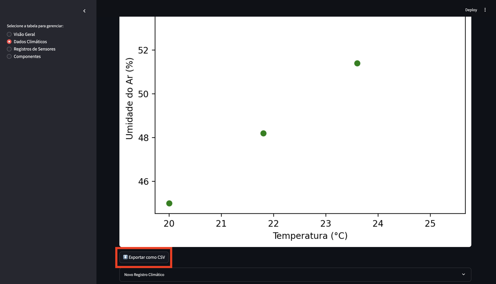

# Entrega 2 e Ir Além 1 e 2: Armazenamento de Dados em Banco SQL com Python, Dashboard e OpenWeather

Este projeto simula a coleta de dados agrícolas, armazenamento e visualização de dados agrícolas utilizando sensores físicos conectados a um ESP32.  
A aplicação em Python foi desenvolvida para armazenar, visualizar e analisar esses dados em um banco de dados Oracle, seguindo boas práticas de arquitetura, organização e clean code.

Esta documentação cobre os requisitos da Entrega 2 e as atividades "Ir Além", explicando a arquitetura, implementação, integração e justificativas das decisões de design para a fase atual.

🚀 Visão Geral

O sistema é composto por três principais módulos:

- Coleta de Dados (ESP32): captura dados dos sensores, incluindo umidade, fósforo, potássio e pH do solo, além do status da bomba de irrigação. 
- Armazenamento e Processamento (Python/Oracle): recebe os dados do ESP32, valida e armazena no banco de dados. 
- Visualização e Análise (Streamlit): permite a análise dos dados históricos por meio de gráficos e tabelas.

## Estrutura do Projeto

```
FIAP-F3-C1/
├──src/python/
    ├── database/                   # Camada de acesso a dados
│   │   ├── __init__.py
│   │   ├── models.py               # Definição dos modelos SQLAlchemy
│   │   ├── oracle.py                # Configuração da conexão Oracle
│   │   ├── setup.py                # Script de inicialização do banco
│   │   ├── utils.py                # Script para geração do DDL e MER 
│   │   └── repositories/           # Implementação dos repositórios
│   │       ├── __init__.py
│   │       ├── application_repository.py
│   │       ├── climate_data_repository.py
│   │       ├── component_repository.py
│   │       ├── crop_repository.py
│   │       └── producer_repository.py
│   │       └── sensor_record.py
│   │
│   ├── logs/                       # Logs do sistema
│   ├── services/                   # Camada de serviços
│   │   ├── weather_service.py      # Serviço de comunicação de dados via Serial
│   │   ├── sensor_service.py       # Serviço de processamento de registros de sensores
│   │   ├── producer_service.py     # Serviço de processamento de produtores
│   │   ├── crops_service.py        # Serviço de controle de colheita
│   │   ├── component_service.py    # Serviço de gerenciamento de produtores
│   │   ├── climate_service.py      # Serviço de gerenciamento de dados da API OpenWeather
│   │   └── application_service.py  # Serviço de gerenciamento de aplicações
│   │
│   ├── tests/                      # Testes automatizados
│   │   ├── __init__.py
│   │   ├── conftest.py             # Configurações dos testes
│   │   ├── test_models.py          # Testes dos modelos
│   │   ├── test_repositories.py    # Testes dos repositórios
│   │
│   ├── .env                        # Variáveis de ambiente
│   ├── .gitignore                  # Arquivos ignorados pelo git
│   ├── main.py                     # Ponto de entrada da aplicação
│   ├── app_dashboard.py            # Código da dashboard com Streamlit
│   ├── pytest.ini                  # Configuração do pytest
│   ├── README.md                   # Documentação do projeto
│   └── requirements.txt            # Dependências do projeto
```

### Descrição dos Diretórios

#### config/
Contém as configurações do projeto, incluindo:
- Configurações do banco de dados
- Constantes do sistema
- Configurações de logging
- Variáveis de ambiente

#### database/
Implementa a camada de acesso a dados:
- `models.py`: Define as classes que mapeiam as tabelas do banco
- `oracle.py`: Gerencia a conexão com o banco Oracle
- `setup.py`: Script para inicialização do banco
- `repositories/`: Implementa o padrão Repository para cada entidade

#### examples/
Contém exemplos de uso do sistema:
- Exemplos de uso dos repositórios
- Exemplos de consultas complexas
- Exemplos de integração com serviços

#### logs/
Armazena os logs do sistema:
- Logs da aplicação em produção
- Logs dos testes
- Logs de erro e debug

#### services/
Implementa a lógica de negócio:
- Processamento de dados dos sensores
- Lógica de controle de irrigação
- Regras de negócio do sistema

#### tests/
Contém os testes automatizados:
- Testes unitários
- Testes de integração
- Fixtures e configurações de teste

## Como Executar o Projeto

### Pré-requisitos

- [Python 3.9+](https://www.python.org/downloads/)
- Oracle Instant Client instalado e configurado
- Banco Oracle disponível (ou acesso ao banco simulado pela FIAP)
- IDE recomendada: VSCode

### Configuração do Ambiente

1. **Clonar o projeto e acessá-lo**:
```bash
git clone https://github.com/anacornachi/FIAP-F3-C1.git
cd FIAP-F3-C1/src/python
```

2. **Criar e ativar ambiente virtual**:
```bash
# Linux/Mac
python3 -m venv .venv
source .venv/bin/activate

# Windows
python -m venv .venv
.venv\Scripts\activate
```

3. **Instalar dependências**:
```bash
pip install -r requirements.txt
```

4. **Configurar variáveis de ambiente**:
Crie um arquivo `.env` na pasta `src/python` com as variáveis do banco de dados da FIAP. Use o arquivo .env.example para identificar as variáveis utilizadas.

   
5. **Executar o sistema**:
```bash
python main.py
```

> Importante: Ao executar o `main.py`, as tabelas serão criadas e todos os dados serão populados automaticamente usando o script `seed.py`, garantindo que todas as tabelas tenham registros iniciais para testes.

### Executando os Testes

Para executar os testes do projeto:

```bash
# Na pasta src/python
PYTHONPATH=$PYTHONPATH:$(pwd) pytest
### Verificar logs dos testes
pytest -v
```

## Dados de exemplo

Após executar o script `seed.py`, o banco será populado com dados iniciais para simulação. Aqui estão alguns exemplos

### Producers

| id                                   | name           | email                    | phone           |
|:-------------------------------------|:---------------|:-------------------------|:----------------|
| 1f45ae23-3a4b-4b09-a123-6cdd1f6e4b6f | João Silva     | joao.silva@email.com     | (11) 99999-9999 |
| 2b33ae27-4b09-4a56-b123-6cdd2f7d5b7f | Maria Oliveira | maria.oliveira@email.com | (21) 98888-8888 |

### Crops

| id                                   | name   | type | start_date   | end_date   | producer_id                          |
|:-------------------------------------|:-------|:-----|:-------------|:-----------|:-------------------------------------|
| 9d5af123-4c09-4b09-a123-6cdd1f6e4b6f | Milho  | Grão | 2024-01-01   | 2024-12-31 | 1f45ae23-3a4b-4b09-a123-6cdd1f6e4b6f |
| 4b56ae23-3b78-4b09-a123-6cdd1f6e4b6f | Soja   | Grão | 2024-02-01   | 2024-11-30 | 2b33ae27-4b09-4a56-b123-6cdd2f7d5b7f |

### Components

| id                                   | name              | type     | crop_id                              |
|:-------------------------------------|:------------------|:---------|:-------------------------------------|
| 3f45ae23-3a4b-4b09-a123-6cdd1f6e4b6f | Sensor de Umidade | Sensor   | 9d5af123-4c09-4b09-a123-6cdd1f6e4b6f |
| 7b33ae27-4b09-4a56-b123-6cdd2f7d5b7f | Atuador da Bomba  | Actuator | 9d5af123-4c09-4b09-a123-6cdd1f6e4b6f |

### Sensor Records

| id                                   |   soil_moisture | phosphorus_present   | potassium_present   |   soil_ph | component_id                         |
|:-------------------------------------|----------------:|:---------------------|:--------------------|----------:|:-------------------------------------|
| 9f45ae23-3a4b-4b09-a123-6cdd1f6e4b6f |            30.5 | True                 | False               |       6.8 | 3f45ae23-3a4b-4b09-a123-6cdd1f6e4b6f |
| 4b33ae27-4b09-4a56-b123-6cdd2f7d5b7f |            55.3 | False                | True                |       5.4 | 3f45ae23-3a4b-4b09-a123-6cdd1f6e4b6f |


## Modificações no MER da Fase 2 para Fase 3

### Fase 2 (Anterior)

- IDs inteiros, sem suporte a UUIDs.
- Estruturas básicas para sensores, leituras, culturas e produtores.
- Relacionamentos unidirecionais sem suporte a cascatas.
- Dados estruturados em português, dificultando padronização para integração internacional. 

### Fase 3 (Atual)

- Identificadores Universais (UUIDs):
  - Os IDs das tabelas foram convertidos de inteiros para UUIDs, melhorando a segurança e escalabilidade.

- Tabela Component (antes Sensor):
  - Agora representa tanto sensores quanto atuadores, permitindo uma modelagem mais próxima da realidade dos sistemas IoT
  - O campo modelo foi substituído por type, diferenciando dispositivos entre Sensor e Actuator, refletindo melhor os elementos físicos utilizados.

- Tabela SensorRecord (antes Leitura_Sensor):
  - O registro de sensores foi simplificado para refletir as mudanças no hardware do ESP32:
    - valor_npk_fosforo e valor_npk_potassio foram convertidos para os campos booleanos phosphorus_present e potassium_present, já que os sensores são simulados como botões digitais. 
    - Campos como soil_moisture, soil_ph foram renomeados para inglês, facilitando a integração com APIs externas e futuras expansões internacionais.

- Adição de ClimateData:
  - Nova entidade para armazenar dados meteorológicos externos, coletados via API, integrando previsões ao sistema de irrigação para decisões mais precisas.

- Controle de Integridade:
 - Uso de back_populates para garantir consistência bidirecional nos relacionamentos.
 - Cascading delete para simplificar a manutenção dos relacionamentos e evitar dados órfãos.

- Padronização de Idioma:
  - Todos os campos foram padronizados para inglês, alinhando o sistema com padrões internacionais e facilitando futuras integrações com outros sistemas e serviços.

### Cardinalidade dos Relacionamentos:

- 1 Produtor → N Culturas 
- 1 Cultura → N Componentes (Sensores e Atuadores)
- 1 Componente → N Registros de Sensores 
- 1 Cultura → N Aplicações (Defensores, fertilizates, etc)
- 1 Cultura → N Dados Climáticos

## Justificativa das Escolhas

1. **SQLAlchemy como ORM**
   - Facilita o mapeamento objeto-relacional
   - Fornece abstração do banco de dados
   - Suporta múltiplos bancos de dados

2. **Estrutura de Tabelas**
   - Normalização para evitar redundância
   - Índices para otimização de consultas
   - Timestamps para rastreamento

3. **Validações**
   - Verificação de tipos de dados
   - Restrições de integridade
   - Tratamento de erros

## Observações

- O sistema foi projetado para ser facilmente extensível
- As operações CRUD são documentadas e testadas
- O código segue as melhores práticas de Python
- A estrutura do banco permite futuras expansões

----

## Painel de Visualização (Ir Além 1)

- Implementado com Streamlit. 
- Inclui gráficos de tendência, filtros de dados e exportação para CSV.

### Video da solução

[Navegação da Dashboard + CRUD de dados climáticos (vídeo)](../../assets/navegacao+crud.mp4)

Executando o Painel: 
```bash
streamlit run app_dashboard.py
```

1. Visão Geral do Sistema (Estado atual da safra)

   - Métricas em tempo real para umidade do solo, pH, presença de fósforo, presença de potássio e status da irrigação. 
   - Utiliza colunas para exibir múltiplas métricas de forma compacta e organizada. 
   - Inclui ícones para status da irrigação (💧 para ativada e ⛔ para desligada).

    

2. Análise Climática (Dados Climáticos)

   - Gráficos de tendência para temperatura e umidade do ar.
   - Histogramas para distribuição de temperatura, facilitando a identificação de picos.
   - Gráficos de dispersão para analisar a correlação entre temperatura e umidade.
   - Exportação dos dados em CSV diretamente da interface.

3. Monitoramento de Nutrientes e Irrigação (Registros dos Sensores)

   - Gráficos de barras para visualizar a presença de fósforo e potássio.
   - Gráficos de linha para visualizar o histórico de ativação/desativação da irrigação. 
   - Possibilidade de editar e remover registros diretamente pelo painel.

   

4. Gerenciamento de Componentes (Componentes)

    - CRUD completo para componentes, incluindo sensores e atuadores. 
    - Visualização dos componentes cadastrados e edição em tempo real.

    

### 📊 Gráficos Disponíveis no Dashboard

- Temperatura ao longo do tempo (Dados Climáticos)
- Umidade do ar ao longo do tempo (Dados Climáticos)
- Distribuição da temperatura ambiente (Histograma, Dados Climáticos)
- Correlação entre temperatura e umidade (Gráfico de dispersão, Dados Climáticos)
- Presença de nutrientes (P e K) (Gráfico de barras, Registros de Sensores)
- Histórico do status da irrigação (Gráfico de linha, Registros de Sensores)

### Funcionalidades de Exportação

O dashboard permite exportar os dados em formato CSV, para integração com outras ferramentas de análise. 
   
    

---

## Integração com API Pública (Ir Além 2)

A integração com a API da OpenWeather permite que o sistema obtenha dados climáticos em tempo real para melhorar a tomada de decisões de irrigação. Para isso, você precisa:

1. Configurar o .env
   - Certifique-se de que as seguintes variáveis estão definidas:
   ```
    OPEN_WEATHER_API_KEY=seu_api_key
    OPEN_WEATHER_CITY=sua_cidade
    PORTA_SERIAL=/dev/ttyUSB0
   ```

2. Fluxo de Dados
   - O script weather_service.py busca os dados climáticos e os envia ao ESP32 via porta serial. A lógica é dividida em três partes principais:
   - Busca na API: O método fetch_weather_data() faz a requisição para a OpenWeather e retorna dados como temperatura, umidade e previsão de chuva. 
   - Armazenamento no Banco: Os dados são salvos na tabela ClimateData, que armazena informações meteorológicas para análise futura. 
   - Envio ao ESP32: Os dados são enviados ao ESP32 como JSON para controle local da irrigação.

3. Lógica no ESP32 
   - No código C++, a lógica está estruturada para nunca ativar a irrigação se a previsão de chuva for verdadeira, mesmo que as outras condições para irrigação sejam atendidas. Exemplo:
   ```bash
    // Lógica para interrupção em caso de chuva
    if (rain_forecast) {
        Serial.println("Previsão de chuva detectada. Irrigação cancelada.");
        irrigate = false;
    } else {
        // Regras normais de irrigação
    }
   ```

4. Tabela `ClimateData`
   - Esta tabela foi criada para armazenar os dados climáticos coletados da API. Os campos incluem:

| id                                   | timestamp                 | temperature | air_humidity | rain_forecast |
|:-------------------------------------|:--------------------------|:------------|:-------------|:--------------|
| 9d5af123-4c09-4b09-a123-6cdd1f6e4b6f | 2025-05-16T14:20:00-03:00 | 22.5        | 75.0         | false         |
| 4b56ae23-3b78-4b09-a123-6cdd1f6e4b6f | 2025-05-16T14:25:00-03:00 | 18.0        | 85.0         | true          |

# Na Fase 4, implementamos novas funcionalidades para elevar o projeto a um nível mais avançado:

- Modelo preditivo com **Scikit-learn**
- Dashboard aprimorado com **Streamlit**
- Análise inteligente e recomendações automáticas

### Modelo Preditivo com Scikit-learn

Implementamos um modelo de Machine Learning para predizer a necessidade de irrigação com base nos dados históricos:

```python
# prediction_model.py
from sklearn.ensemble import RandomForestClassifier
# ...

class IrrigationPredictor:
    def train(self):
        """
        Treina o modelo de predição de irrigação usando Random Forest.
        """
        X, y = self._prepare_data()
        X_train, X_test, y_train, y_test = train_test_split(X, y, test_size=0.2)
        
        self.model = RandomForestClassifier(n_estimators=100)
        self.model.fit(X_train_scaled, y_train)
